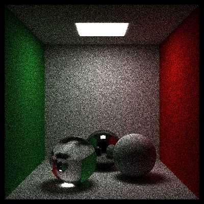
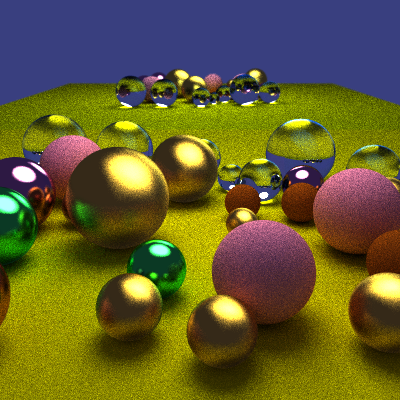
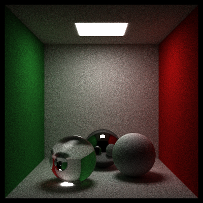
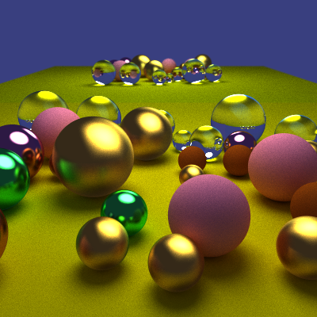

# Tracer
This is a simple path tracer project done mainly for education purposes and practice in data-oriented design.

Currently in a very early stage.

## Status
 

## Output examples
| Settings              |                     Cornell Box                     |               Random Spheres                 |
| :-------------------: | :-------------------------------------------------: | :------------------------------------------: |
| spp 200, bounces 5    |     |     |
| spp 500, bounces 10   |    |    |
| spp 2000, bounces 10  |   |   |
| spp 10000, bounces 10 |  |  |

## Todo
- [ ] Mesh loading and rendering
- [ ] Bounding volume hierarchy
- [ ] HDRi environments
- [ ] Improve sampling 
- [ ] Noise filtering

## 3rd party libraries
* stb\_image.h by Sean Barrett: https://github.com/nothings/stb/blob/master/stb_image.h
* Doctest by Viktor Kirilov https://github.com/onqtam/doctest
* GLM https://github.com/g-truc/glm
